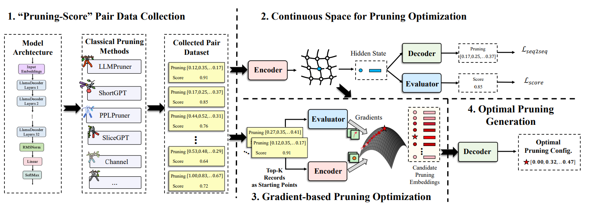

<div align="center">
<h1>Genpruner: Enable Efficient Large Language Models via Generative Pruning</h1>
  <div align="center">
</div>

<p align="center">
 <br>
</p>

## Introduction

#### Supported LLMs:
- [x] [Llama-2 Hugging Face](https://github.com/horseee/LLM-Pruner#1-pruning-discovery-stage--estimation-stage)
- [x] [LLaMA Hugging Face](https://github.com/horseee/LLM-Pruner#1-pruning-discovery-stage--estimation-stage)
- [x] [BLOOM](https://github.com/horseee/LLM-Pruner/tree/main/examples#cherry_blossom-bloom) 
- [x] [Vicuna](https://github.com/horseee/LLM-Pruner#llama-vicuna-pruning)
- [x] [Baichuan](https://github.com/horseee/LLM-Pruner/tree/main/examples#llama-baichuan-pruning)

#### Updates:
* Oct 6, 2024: :tada: Code released! 

#### Contact Us:

Coming !!!
## Table of Contents
  - [Quick Start](#quick-start)

## Quick Start

### 1. Installation
```
pip install -r requirement.txt
```

### 2. Generate optimal pruning ratio

```
cd Generator
bash quick_start.sh
```

### 3. Prune and evaluate the model

```
cd ../Pruner
bash quick_start.sh
```


## Acknowledgement

* The evaluation of the LLM:  <a href="https://github.com/EleutherAI/lm-evaluation-harness">lm-evaluation-harness</a>
* LLaMA: <a href="https://github.com/facebookresearch/llama"> https://github.com/facebookresearch/llama</a>
* Vicuna: <a href="https://github.com/lm-sys/FastChat">https://github.com/lm-sys/FastChat</a>
* Peft: <a href="https://github.com/huggingface/peft">https://github.com/huggingface/peft</a>
* Alpaca-lora: <a href="https://github.com/tloen/alpaca-lora">https://github.com/tloen/alpaca-lora</a>

## Citation
Comming !!!
