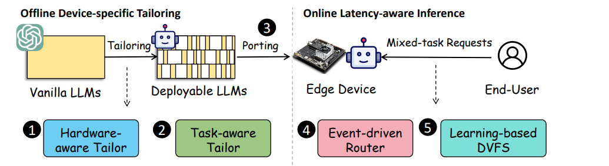

<div align="center">
<h1>CLONE: Customizing LLMs for Efficient Latency-Aware Inference at the Edge</h1>
</div>

<p align="center">
 <br>
</p>

## Introduction
#### Supported LLMs:
- [x] [Llama-2 Hugging Face](https://huggingface.co/meta-llama/Llama-2-7b-hf)
- [x] [LLaMA Hugging Face](https://huggingface.co/huggyllama/llama-7b)
- [x] [BLOOM](https://huggingface.co/bigscience/bloom) 
- [x] [Vicuna](https://huggingface.co/lmsys/vicuna-7b-v1.5)
- [x] [Baichuan](https://huggingface.co/baichuan-inc/Baichuan-7B)

#### Updates:
* May 6, 2025: :tada: Code released! 

#### Contact Us:

Coming !!!
## Table of Contents
This repository supplies only the software‑module code; the hardware components are not available for remote testing.
  - [Quick Start](#quick-start)
  - [Fintune](#fintune)
  - [Evaluation](#evaluation)
## Quick Start

### 1. Installation
```
pip install -r requirement.txt
```

### 2. Generate optimal pruning ratio

```
cd Generator
bash quick_start.sh
```

### 3. Prune and evaluate the model

```
cd ../Pruner
bash quick_start.sh
```
## Fintune
You can run the following command to fintune the modle on different datasets, such as alpaca and bbh.
```
cd ../Pruner
bash fintune.sh
```
## Evaluation
You can run the following command to evalute Llama2-7B on BBH (zero-shot), MMLU (3-shot), PPL, and Commonsense (zero-shot).
```
cd ../Pruner
bash eval.sh
```

## Acknowledgement

* The evaluation of the LLM:  <a href="https://github.com/EleutherAI/lm-evaluation-harness">lm-evaluation-harness</a>
* LLaMA: <a href="https://github.com/facebookresearch/llama"> https://github.com/facebookresearch/llama</a>
* Vicuna: <a href="https://github.com/lm-sys/FastChat">https://github.com/lm-sys/FastChat</a>
* Peft: <a href="https://github.com/huggingface/peft">https://github.com/huggingface/peft</a>
* Alpaca-lora: <a href="https://github.com/tloen/alpaca-lora">https://github.com/tloen/alpaca-lora</a>

## Citation
Comming !!!
